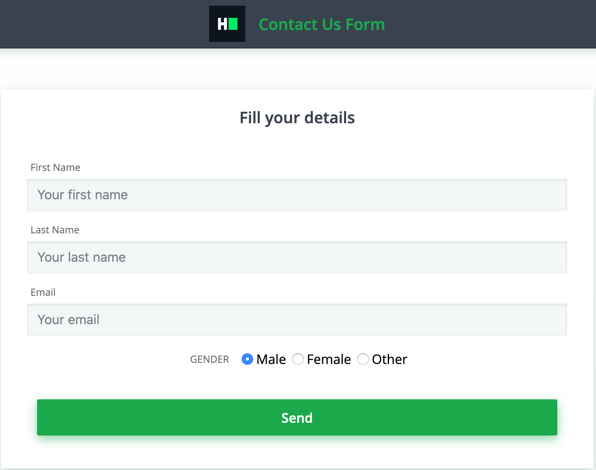

## Environment:
- Java version: 17
- Maven version: 3.*
- Selenium HtmlUnitDriver: 2.52.0

## Read-Only Files:
- src/test/*
- website/*

## Requirements:
In this challenge, you are going to use the Selenium WebDriver, the HtmlUnitDriver, which uses the HtmlUnit headless browser. This means you don't need to set up the browser (like Firefox or Chrome) nor a web driver executable (like FirefoxDriver or ChromeDriver). Every web page has web elements (aka DOM objects) with unique names or ids. Names are usually unique, but this is not a restriction.
 

There is a class `ElementLocator` that has 4 methods:

1. `locateNonTextTypeElements`: This needs to return *input* elements whose type is not *text* and are inside the *form*.
2. `locateContactElements`: This needs to return *input* elements whose *name* starts with *contact* and are inside the *form*.
3. `locateSubmitElement`: This needs to return *button* element having type *submit*. Assume there can be only one submit type button element inside the form.
4. `locateIdMissingElements`: This needs to return *input* elements whose *id* attribute is missing and are inside the *form*.

These methods have 2 parameters, one web driver and one web page URL. The supplied web page has only one form and the will look like the following:



Your task is to complete the implementation of these 4 methods so that the unit tests pass while running the tests.

## Commands
- run: 
```bash
mvn clean package && java -jar target/selenium-java-element-locator-1.0.jar
```
- install: 
```bash
mvn clean install
```
- test: 
```bash
mvn clean test
```
